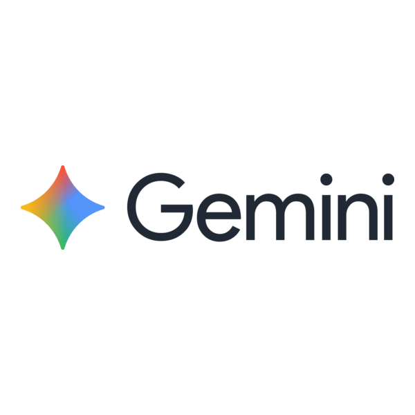

# 🌟 AIDEY

**Ang Gabay sa Dokumento at ID** — a journey-centered mobile and web app that guides Filipinos through acquiring government documents and IDs, from knowing what to prepare to finding the nearest office on the map.

---

## 🚀 About the Project

This project is developed as part of **SparkFest 2026**, a hackathon organized by **Google Developer Groups on Campus – Polytechnic University of the Philippines (GDG PUP)**.

It aims to solve a real-world or community-based problem through technology, innovation, and collaboration.

Built by **Team GLAK** — Lester Matthew Sollano (lead developer), Kristal Mae Tamayo, Angel Geoff Dare, and Gabriel Josef Lacsa — AIDEY turns the overwhelming process of getting Philippine government documents into a clear, step-by-step journey instead of a maze of scattered information.

---

## 🎯 Problem Statement

Every year, millions of Filipinos apply for jobs, enroll in schools, open bank accounts, and access healthcare — and almost every one of those opportunities begins with a government document or valid ID.

Yet the process remains frustrating:

- **Information is scattered** across dozens of agencies, outdated websites, and conflicting social media advice.
- **Requirements depend on other requirements** — you often need an ID to get an ID, leaving people stuck before they even start.
- **People travel for hours** only to be turned away with _"Kulang po requirements"_ or _"Balik na lang po kayo."_
- **Tens of millions still lack a National ID** despite registration campaigns, because knowing _where to start_ is harder than the paperwork itself.

This is not just wasted time — it delays education, employment, financial access, and healthcare for everyday Filipinos.

---

## 💡 Proposed Solution

AIDEY treats every government document like a **destination on a map** — with a clear route from where you are to where you need to go.

- **What it does:** Search or browse 27+ Philippine government documents and IDs, follow structured step-by-step guides, ask an AI assistant for help, upload and store your IDs, and navigate to the nearest issuing office.
- **How it solves the problem:** Instead of dumping information, AIDEY walks users through **requirements → process steps → upload → directions**, unlocking each stage only after the previous one is complete — so users arrive at government offices prepared.
- **What makes it different:** It is **journey-centered, not information-centered** — combining curated document guides, a context-aware AI assistant (Gemini), GPS-based office finder, interactive maps with routing, bilingual support (English and Filipino), and speech-to-text search in one friendly, mascot-guided experience.

> _"Because every opportunity begins with a document… and every document should begin with AIDEY."_

---

## ⚙️ Features

- **Document & ID catalog** — Browse and fuzzy-search 27 government documents across IDs, clearances, civil registry, and immigration categories
- **Step-by-step guides** — Checklist-style requirements, numbered process steps, and estimated timelines for each document, with progress saved as you go
- **Document dependency linking** — See which other IDs or documents can satisfy a prerequisite (e.g., PSA Birth Certificate for PhilID) and track what you already have uploaded
- **AI virtual assistant** — Gemini-powered chat with suggested replies, task checklists, chat history, and awareness of your guide progress and owned documents
- **Nearest office finder & map directions** — GPS-based lookup of the closest government agency, with an interactive map and turn-by-turn routing via Google Maps
- **Document upload & storage** — Capture or pick photos of your IDs; sync to Firebase Storage when signed in, with local caching for offline access
- **Bilingual UI** — Full English and Filipino (Tagalog) support across the app, guides, and AI responses
- **Speech-to-text search** — Dictate document names instead of typing when searching the catalog
- **User accounts** — Firebase Authentication (email/password) to sync uploads, chat sessions, and guide progress across devices

---

## 🧪 Tech Stack

- **Frontend:** React Native, Expo SDK 56, Expo Router, React Native Web
- **Backend:** Firebase (Authentication, Cloud Storage, Realtime Database)
- **AI:** Google Gemini API (`@google/genai`)
- **Maps & Location:** React Native Maps, Google Maps Platform (Routes API, Places API, Maps SDK), Expo Location
- **Tools:** TypeScript, EAS Build, Firebase Hosting, Figma, GitHub

###  Google APIs & SDKs

**Gemini API** · [`@google/genai`](https://www.npmjs.com/package/@google/genai)

Powers the AI assistant chat. Sends conversation history plus app context (owned documents, guide progress, location, checklists) to Gemini models and receives structured JSON replies with messages, suggested chips, task checklists, and map destinations. Falls back across multiple models (`gemini-2.5-flash`, `gemini-2.5-flash-lite`, etc.) if one fails.

**Firebase Authentication** · Firebase JS SDK (`firebase/auth`)

Email/password sign-up and sign-in. Gates cloud sync so uploads, chat sessions, and guide progress are tied to a user account.

**Firebase Cloud Storage** · Firebase JS SDK (`firebase/storage`)

Stores uploaded ID and document photos in the cloud. Images are saved locally first, then synced to Storage when the user is signed in and online.

**Firebase Realtime Database** · Firebase JS SDK (`firebase/database`)

Syncs user data across devices: chat session history, document upload metadata, and step-by-step guide progress (checked requirements, completed steps).

**Firebase Hosting** · Firebase CLI

Hosts the static web build of the app at [aidey.web.app](https://aidey.web.app).

**Google Routes API** · REST (`routes.googleapis.com/directions/v2:computeRoutes`)

Computes driving routes from the user's GPS location to the nearest government office. Returns distance, duration, and an encoded polyline drawn on the in-app map.

**Google Places API** · Places Text Search (`maps/api/place/textsearch/json`)

Finds the nearest issuing office when the user asks for directions or when the AI sets a `mapDestination`. Searches by agency name (e.g. PSA, LTO, DFA) with a 50 km radius bias around the user's location, then ranks results by distance.

**Google Maps SDK for Android** · `react-native-maps` (`PROVIDER_GOOGLE`)

Renders the interactive map on Android with Google map tiles, destination markers, the user's live location, and the driving route polyline.

> **Note:** Device GPS and reverse geocoding use Expo Location (native OS services), not a Google API. Speech-to-text search uses the device's built-in speech recognition via `expo-speech-recognition`.

---

## 🌐 Deployed Project

- **Live Demo:** [https://aidey.web.app](https://aidey.web.app)
- **Github Link:** [https://github.com/lestersollano/AIDEY](https://github.com/lestersollano/AIDEY)
